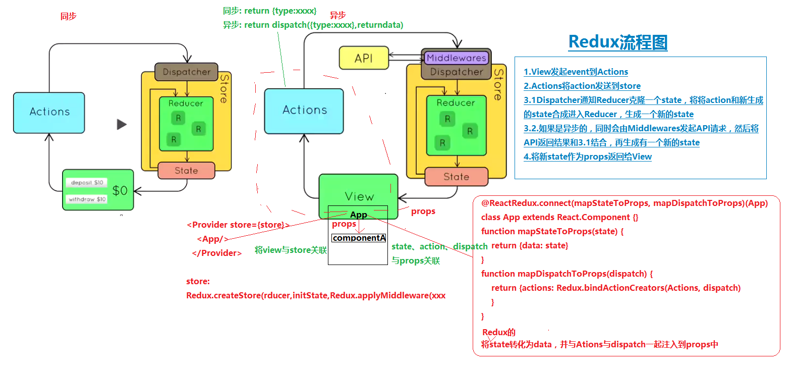

# Redux
> Flux的一种实现方式

> - 1.View发起event到Actions
> - 2.Actions将action发送到store
> - 3.1Dispatcher通知Reducer克隆一个state，将将action和新生成的state合成进入Reducer，生成一个新的state
> - 3.2.如果是异步的，同时会由Middlewares发起API请求，然后将API返回结果和3.1结合，再生成有一个新的state
> - 4.将新state作为props返回给View
**Reducer永远是同步操作的，因此会相当于走输出了两次**

## 使用
main.js
```
ReactDOM.render(
  <Provider store={store}>
    <App/>
  </Provider>,
  document.getElementById('JS-container')
)
```

store
```
export default function configureStore(initState){
  return Redux.createStore(rootReducer,initState,Redux.applyMiddleware(thunkMiddleware)); // 初始化创建
}
```

app.js
```
class App extends React.Component{}
function mapStateToProps(state) {
    return {
        data: state
    }
}
function mapDispatchToProps(dispatch) {
    return {
        actions: Redux.bindActionCreators(LightActions, dispatch)
    }
}
// 声明 connect 连接,将state、action、dispatch放到props传给view
App = ReactRedux.connect(mapStateToProps, mapDispatchToProps)(App);
```
```
//ES7这么写
@ReactRedux.connect(mapStateToProps, mapDispatchToProps)
class App extends React.Component{}
function mapStateToProps(state) {
    return {
        data: state
    }
}
function mapDispatchToProps(dispatch) {
    return {
        actions: Redux.bindActionCreators(LightActions, dispatch)
    }
}
```

action
```
//Action 定义用户要触发的行为，向store传递数据信息
// Action（普通Action、异步Action）
// 普通Action，本质是JS普通对象
// 异步Action，使用了 Thunk middleware 异步 action
import * as lights from '../constants/ActionTypes.es';
export function changegreen(){
  return {type:lights.CHANGE_GREEN}
}
export function changeyellow(){
  // return {type:lights.CHANGE_YELLOW}
  return (dispatch, getState) => {
        reqwest({
          url: 'data',
          type: 'json'
         })
         .then((resp)=> {
            console.log(resp);
            dispatch({type:lights.CHANGE_YELLOW,isLoading:true,text:resp});
         })
         .fail((err)=> {
            console.log("出错"+err);
            dispatch({type:lights.CHANGE_YELLOW,isLoading:true,text:"error"});
         });
   }
}
export function changered(){
  return {type:lights.CHANGE_RED}
}
```

reducer
```
//用来执行根据指定 action 来更新 state 的逻辑 store.dispatch(action) 触发
import {CHANGE_GREEN, CHANGE_YELLOW, CHANGE_RED} from '../constants/ActionTypes.es';

// 定义初始化状态，初始化状态是常量
// 初始状态是红灯
const initState = {
  color:'red',
  isLoading:false // 持续时间20ms
}
// 定义灯转换的reducer函数
function light(state=initState,action){
  switch(action.type){
    case CHANGE_GREEN:
      return {
        color:'green',
        isLoading:false
      }
    case CHANGE_YELLOW:
      return {
        color:'yellow',
        isLoading:action.isLoading,
        text:action.text
      }
    case CHANGE_RED:
      return Object.assign({},initState);

    default:
      return state
  }
}
const rootReducer = Redux.combineReducers({
  light
})
export default rootReducer;

```
