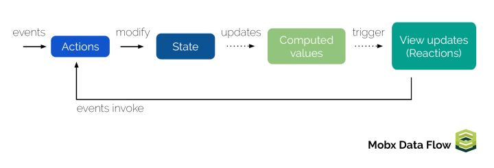

# Mobx
## 简介
> - Mobx是一个功能强大，上手非常容易的状态管理工具，它比react-redux简单，便于实现状态管理及视图更新
> - Mobx使用了观察者(observable)与被观察者(observer)的概念，响应式编程

## 安装及配置
> - npm i -S mobx
> - npm i -S mobx-react
> - 配置ESNext 的装饰器（ES7的decorator）
```
npm i -D babel-plugin-transform-decorators babel-plugin-transform-decorators-legacy babel-preset-stage-1
```
## 使用
> - 建议开启mobx严格模式，它与javascript的严格模式是两种东西，不要混为一谈
> - mobx严格模式: mobx将修改被观测变量的行为放在action中，可以防止数据被任意修改，降低程序的不确定性
> - @ 真实的作用是面向切面编程(AOP)的注入(IOC)
> - **action只能影响正在运行的函数，而无法影响当前函数调用的异步操作**

```
import {observable, action, useStrict} from 'mobx';
useStrict(true);
class Store {
    @observable number = 0;
    @action add = () => {
        this.number++;
    }
    @action syncAdd = () => {
        setTimeout(() => {
            action('syncAdd - action', () => {
                this.number++;
                console.log(this.number);
            })();
        }, 0);
    }
}
const newStore = new Store();
newStore.add();
console.log(newStore.number);
newStore.syncAdd();
//严格模式下，如果去掉action前面的@会报错
//action无法影响当前函数调用的异步操作，所以必须再用一个action来包裹住回调函数
/action在修饰函数的同时，我们还可以给它设置一个name：syncAdd - action，这个name可以作为一个注释更好地让其他人理解这个action的意图
```
> - 实际开发中使用 async function来处理异步action，这就用到了mobx的runInAction
> - npm i -D babel-plugin-transform-runtime
> - npm i -S babel-polyfill babel-runtime

```
import {observable, action, useStrict, runInAction} from 'mobx';
useStrict(true);
function getAsyncName(){
    return new Promise(resolve => {
        setTimeout(() => resolve('xfz'), 0);
    });
}
class Store {
    @observable name;
    @action getName = async () => {
        const name = await getAsyncName();
        runInAction(() => {
            this.name = name;
        });
    }
}
const newStore = new Store();
newStore.getName();
setTimeout(() => {
    console.log(newStore.name);
}, 1000);
//你可以把runInAction有点类似action(fn)()的语法糖，调用后，这个action方法会立刻执行
```

## 结合React使用
> - npm i -S mobx-react
> - 如果单独是react的state，需要经过 App state props(state,func) -> 组件 调用props.func - 调用 父组件的方法改变state，比较麻烦
> - mobx可以理解一个公共的观察者(公共对象),可以被@observer修饰的组件使用

```bash
import React from 'react';
import { render } from 'react-dom';
import { observable, action, useStrict, runInAction } from 'mobx';
import { observer } from 'mobx-react';

useStrict(true);

class MyState {
  @observable num = 0;
  @action addNum = () => {
    this.num++;
  };
}

const newState = new MyState();

@observer
class App extends React.Component {
  render() {
    return (
      <div>
        <p>{newState.num}</p>
        <button onClick={newState.addNum}>+1</button>
      </div>
    )
  }
}

render(
    <App />,
    document.getElementById('app')
);
//@observer修饰组件类，便可以使用这个newState对象中的值和函数了
```
### 跨组件交互
```bash
import React from 'react';
import { render } from 'react-dom';
import { observable, action, useStrict, computed} from 'mobx';
import { observer } from 'mobx-react';

useStrict(true);

class MyState {
  @observable num1 = 0;
  @observable num2 = 100;

  @action addNum1 = () => {
    this.num1 ++;
  };
  @action addNum2 = () => {
    this.num2 ++;
  };
  @computed get total() {
    return this.num1 + this.num2;
  }
}

const newState = new MyState();

@observer
class Main extends React.Component {
  render() {
    return (
        <div>
            <p>num1 = {this.props.store.num1}</p>
            <p>num2 = {this.props.store.num2}</p>
            <div>
              <button onClick={this.props.store.addNum1}>num1 + 1</button>
              <button onClick={this.props.store.addNum2}>num2 + 1</button>
            </div>
        </div>
    )
  }
}

@observer
class AllNum extends React.Component {
  render() {
    return (
      <div>sum: {this.props.store.total}</div>
    )
  }
}

@observer
class App extends React.Component {
  render() {
    return (
      <div>
        <Main store={newState} />
        <AllNum store={newState} />
      </div>
    )
  }
}

render(
    <App />,
    document.getElementById('app')
);
```
如果组件树较深使用React的context上下文

### React组件中可以直接添加@observable修饰的变量
```bash
import React from 'react';
import { render } from 'react-dom';
import { observable, action, useStrict, computed} from 'mobx';
import { observer } from 'mobx-react';

useStrict(true);

@observer
class App extends React.Component {
  constructor(){
    super();
    this.state = {a:0};
  }
  @observable b = 1;
  @action add = () => {
    this.b++;
  }
  componentWillReact(){
    console.log('我更新了');
  }
  render() {
    return (
      <div>
        <p>{this.state.a}</p>
        <p>{this.b}</p>
        <button onClick={this.add}>add</button>
      </div>
    )
  }
}

render(
    <App />,
    document.getElementById('app')
);
//添加@observer后,组件会多一个生命周期componentWillReact,当组件内被observable观测的数据改变后，就会触发这个生命周期
**注意:setState并不会触发这个生命周期！state中的数据和observable数据并不算是一类**
另外被observable观测数据的修改是同步的，不像setState那样是异步
```
### Observable Object和Observable Arrays
> - 如果使用observable来修饰一个Javascript的简单对象，那么其中的所有属性都将变为可观察的,如果其中某个属性是对象或者数组，那么这个属性也将被observable进行观察，说白了就是递归调用
> - **注意：只有对象上已经存在的属性，才能被observable所观测到**
> - 若是当时不存在，后续添加的属性值，则需要使用extendObservable来进行添加
```
let observableObject = observable({value: 3222});
extendObservable(observableObject, {
  newValue: 2333
});
```
### 单例模式
单例模式创建数据对象: 这样能更简单地在不同模块之间共享数据，也能避免数据的重复加载
```bash
/** [file] hostUserStore.js */
import { observable } from 'mobx'
import { post, get } from './Ajax'

class HostUser {

  @observable user = {}

  constructor() {
    this.getHost()
  }


  getHost = ()=> {
    post('/user/login.do', {...params}, (data, succeed)=> {
      if(succeed) {
        this.user = data.user;
      }
    }
  }
}

export default new HostUser()
//A和B都引了该store，只会执行一次，而不会重复执行
```
## 开发经验
**把业务处理放置于store中，让组件尽量与业务解耦**
1.store公用（顶层）- 推荐，便于管理
```
把公用的store提出来放置在公共store中，stores/index.js，放置于顶层，通过props一层一层往下传，或者使用context跨级传
而不需公共使用的store就根据组件按需引入
```

2.全部按需加载store，来看看以下几种情况的用法
```bash
情况一: 组件A 引入 stroeA，组件B 也引入 storeA
storeA: export default new storeA();
//mobx内部实现了单例模式，storeA内部只会执行一次，这样组件A/B就可以共享storeA的observable数据了，而不必担心数据不统一

情况二: 组件A 引入 storeA, 组件B 引入 storeB, storeB 引入 storeA
【storeeA的监听数据是同步数据，而不是异步接口获取的数据】
storeB能共享storeA的数据，storeA.yourData
【storeA的监听数据是经过异步接口处理的数据，storeB想使用需要特殊处理】

```