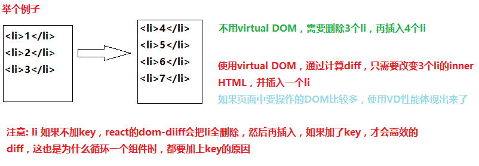

# React Study
## 原理 
ng: 对dom元素的拓展，让dom实现一些功能，指令为dom添加功能的同时，会为dom元素增加内存开销，举个例子，比如页面是一个汽车，ng为其添加装饰，结果汽车很漂亮，另一方面要提高马力，才能开动汽车，这样需要资源更多
react: 自己创建一个汽车(virtual dom)，添加轮子、发动机，没有添加任何的装饰，这样只需要很小的马力就能跑了，性能高效
react不是完整的MVC/MVVM框架，它只专注与提供清晰、简洁的视图层解决方案
*高性能网站优化*
1.减少HTTP连接请求 (前端工程化)
2.避免重定向连接   (后端控制、前端尽量避免location)
3.把部分内容压缩   (前端工程化)
4.避免CSS表达式
5.减少DNS查找
6.避免大量DOM操作
> 对DOM元素的增删改查会造成页面的Repaint和Reflow，循环对DOM操作更是罪恶的行为
> 合理使用js变量存储内容，在循环结束时一次性写入
> 减少DOM元素的查询和修改，查询时可将其赋值给局部变量
### 特点
*. 数据单向传输原则
1.虚拟DOM: 最大限度地减少与DOM的交互
> 虚拟DOM呈现dom就是React抽象出来的一个对象，用来描述DOM应该是什么样子的，应该如何呈现，这个虚拟DOM去更新管理真实的DOM

> 实现原理
> - 在React中，对虚拟DOM的操作，不会立即映射到真实DOM上，等到事件循环结束
> - 在此之前，不会操作DOM，React会计算出虚拟DOM的变化(diff),并以尽少的操作将diff作用到真实的DOM上.
> - 批量DOM操作以及虚拟DOM变化检测将由React处理
> - 虚拟DOM变化检测
>   当修改DOM时，React会将修改的虚拟DOM节点标记为修改过(dirty)，在事件循环结束时，会对所有修改过的虚拟DOM节点进行处理，并映射到真实DOM
 
2.组件开发: 组件片段化，便于开发复用、管理与维护
3.适用多端: 一处开发，多端适用


## 环境配置
> React在0.13版本之后发生了一次重大改变
> 将react拆分成两个库
> - react.min.js: 创建虚拟DOM、
> - react-dom.min.js: 渲染虚拟DOM

###sublime JSX插件


###CDN方式:
> react.min.js - React 的核心库
> react-dom.min.js - 提供与 DOM 相关的功能
> babel.min.js - 转换ES6
```
<script src="https://cdn.bootcss.com/react/15.4.2/react.min.js"></script>
<script src="https://cdn.bootcss.com/react/15.4.2/react-dom.min.js"></script>
<script src="https://cdn.bootcss.com/babel-standalone/6.22.1/babel.min.js"></script>
```
###npm方式:
1. 创建package.json项目配置文件
   cnpm init
2. 安装webpack，并设置为项目依赖，前提要线全局安装webpack
   cnpm install --save-dev webpack
3. 创建一个webpack.config.js文件, [参考文档](https://webpack.js.org/configuration/)
```
// webpack.config.js
const path = require('path');
module.exports = {
  entry: "./app/main.js",
  output: {
    path: path.resolve(__dirname, "dist"), // string
    filename: "all.js", // string
  }
}
```
4. 安装babel，[参考文档](https://github.com/babel/babel-loader)
   cnpm install --save-dev babel-loader babel-core babel-preset-es2015
```
module: {
    rules: [
      {
        test: /\.js$/,
        exclude: /(node_modules|bower_components)/,
        use: {
          loader: 'babel-loader',
          options: {
            presets: ['es2015']
          }
        }
      }
    ]
  }
```
5. 安装react、react-dom和babel-preset-react
   cnpm install --save-dev react react-dom babel-preset-react
6. 修改webpack.config.js，增加一个babel翻译的配置项presets
```
presets: ['es2015','react']
```
6. 修改webpack.config.js，新增自动webpack
   watch: true
7. 启动webpack

###fis方式
> npm install -g fis3 fis3-parser-less fis3-parser-babel2
> 在根目录下新建 fis-conf.js
```
//fis-conf.js
fis.match('**.jsx',{
  //编译jsx语法
  parser: 'babel2',
  //更改后缀名
  rExt: '.js'
});
//编译less
fis.match('**.less',{
  parser: 'less',
  rExt: '.css'
});
//1.jsx
//创建list组件
var List = React.createClass({
  render: function(){
    return (
      <ul>
        <li>唯品会</li>
        <li>亚马逊</li>
        <li>当当网</li>
      </ul>
    );
  }
});
ReactDOM.render(<List />, document.getElementById('app'));
//1.html
<link rel="stylesheet" href="style.less">
<div id="app"></div>
<script src="https://cdn.bootcss.com/react/15.6.1/react.min.js"></script>
<script src="https://cdn.bootcss.com/react/15.6.1/react-dom.min.js"></script>
<script src="code/1.jsx"></script>
```

> 使用fis步骤
> 1.发布 fis3 release -w
> 2.启动 fis3 server start

### react.min.js
> - createElement(virtualName, props, children) 创建虚拟DOM
> - virtualName: 虚拟dom名称，通常是html中dom元素的名称，还可以组件名称
> - props: 属性对象
> - children: 从第三个参数开始，虚拟dom的子虚拟dom元素,如果是元素,用createElement,如果是文本直接书写
```
<div id="example"></div>
<div id="app"></div>
<script>
  var h1 = React.createElement(
      'h1',
      {
        id: 'title'
      },
      'tell why'
  );
  ReactDOM.render(h1, document.getElementById('example'),function(){
    console.log('success');
  }); 
  var ul = React.createElement(
      'ul',
      null,
      React.createElement('li', null, '唯品会'),
      React.createElement('li', null, '当当网'),
      React.createElement('li', null, '京东')
  );
  ReactDOM.render(ul, document.getElementById('app'),function(){
    console.log('success');
  }); 
</script>
//结果页面渲染出真实DOM <h1 id="title">tell why</h1>
```


## React JSX
> React 使用 JSX 来替代常规的 JavaScript,JSX 是js和XML的语法糖，像创建元素一样创建虚拟DOM
> *优点*: 
> - JSX 执行更快，因为它在编译为 JavaScript 代码后进行了优化
> - 它是类型安全的，在编译过程中就能发现错误
> - 使用 JSX 编写模板更加简单快速
> *语法*: 
>  - 只能有一个根元素
>  - 单标签一定要闭合
>  - 添加自定义属性需要使用 data- 前缀
>  - class: className、 for: htmlFor
>  - React JSX 代码可以放在一个独立文件上, hello.js
>  - JSX 的基本语法规则：遇到 HTML 标签（以 &lt; 开头），就用 HTML 规则解析；遇到代码块（以 { 开头），就用 JavaScript 规则解析
>  - 数组中如果是JSX语法，数组会被自动展开，所以并不需要像VUE的v-for指令展开数组
>  - 注意，react要求JSX数组循环中要加上key属性,

例子
```
ReactDOM.render(
    <div>
    <h1>教程</h1>
    <h2>欢迎学习 React</h2>
    <p data-myattribute = "somevalue">这是一个很不错的 JavaScript 库!</p>
    </div>
    ,
    document.getElementById('example')
);
```
> HTML 语言直接写在 JavaScript 语言之中，不加任何引号，这就是 JSX 的语法，它允许 HTML 与 JavaScript 的混写
```
var names = ['Alice', 'Emily', 'Kate'];
ReactDOM.render(
  <div>
  {
    names.map(function (name,index) {
      return <div key="index">Hello, {name}!</div>
    })
  }
  </div>,
  document.getElementById('example')
);
```
>你的 React JSX 代码可以放在一个独立文件上
```
<body>
  <div id="example"></div>
<script type="text/babel" src="helloworld_react.js"></script>
</body>
``` 
> 我们可以在 JSX 中使用 JavaScript 表达式。表达式写在花括号 {} 中
```
ReactDOM.render(
    <div>
      <h1>{1+1}</h1>
    </div>
    ,
    document.getElementById('example')
);
```
> 注意:在JSX中不能使用if语句,但可以使用三元运算、方法、逻辑运算符、万能表达式来替代
> 三目运算符
```
 var i = 1;
 ReactDOM.render(
    <div>
      <h1>{i === 1 ? 'True!' : 'False'}</h1>
    </div>
    ,
    document.getElementById('example')
);
```
> 内部方法
```
      var Test = React.createClass({
        getName(){
          if(this.props.name){
            return this.props.name;
          }else{
            return 'Someone';
          }
        },
        render(){
          var name = this.getName();
          return (
            <div>{name}</div>
          ); 
        }
      });
      ReactDOM.render(
         <Test/>,
         document.getElementById('example')
      );
```
> 逻辑运算符
```
      var Test = React.createClass({
        render(){
          return (
            <div>{this.props.name || 'Someone'}</div>
          );
        }
      });
      ReactDOM.render(
         <Test/>,
         document.getElementById('example')
      );
```
> 万能表达式
```
      var Test = React.createClass({
        render(){
          return (
            <div>Hello, {
              (function(obj){
                if(obj.props.name)
                  return obj.props.name
                else
                  return 'Someone'
              })(this)
            }</div>
          );
        }
      });
      ReactDOM.render(
         <Test name="Xfz"/>,
         document.getElementById('example')
      );
```

> 样式:
> React 推荐使用内联样式。我们可以使用 camelCase 语法来设置内联样式. React会在指定元素数字后自动添加 px 
```
    <script type="text/babel">
      var myStyle = {
         fontSize: 20,
         color: 'pink'
      };
      ReactDOM.render(
        <h1 style = {myStyle}>教程</h1>,
        document.getElementById('example')
      );
```
> 在标签内部的注释需要写在花括号中{/*...*/},在标签外的的注释不能使用花括号
```
ReactDOM.render(
    /*标签外注释*/
    <div>
    <h1>菜鸟教程</h1>
    {/*注释...*/}
     </div>,
    document.getElementById('example')
);
```
> 数组
```
var arr = [
  <h1>菜鸟教程</h1>,
  <h2>学的不仅是技术，更是梦想！</h2>,
];
ReactDOM.render(
  <div>{arr}</div>,
  document.getElementById('example')
);
```
### 数据嵌入技巧
```
      var data = {name: 'xfz', sex: 'male'};
      var HelloWorld = React.createClass({
        render(){
          return <div><span>{this.props.name}</span> <span>{this.props.sex}</span></div>;
        }
      });
      ReactDOM.render(
        <HelloWorld {...data} />,
        document.getElementById('example')
      );
```
> HTML 标签 vs. React 组件
> React 可以渲染HTML标签或React 组件,要渲染HTML标签,只需在JSX 里使用小写字母的标签名
```
var myDivElement = <div className="foo" />;
ReactDOM.render(myDivElement, document.getElementById('example'));
```
> 非DOM属性 
> - dangerouslySetInnerHTML : 在JSX中直接插入HTML代码
> - ref : 父组件引用子组件
> - key : 提高渲染性能
```
      var rawHTML = {
        __html : '<p>I am inner HTML</p>'//__html 固定写法
      }
      
      ReactDOM.render(
         <div dangerouslySetInnerHTML={rawHTML}></div>,
         document.getElementById('example')
      );
```
> 要渲染 React 组件，只需创建一个大写字母开头的本地变量
> 组件的style属性不能写成style="opacity:{this.state.opacity};"，而要写成 style={{opacity: this.state.opacity}}

```
var MyComponent = React.createClass({/*...*/});
var myElement = <MyComponent someProperty={true} />;
ReactDOM.render(myElement, document.getElementById('example'));
```
> React 的 JSX 使用大、小写的约定来区分本地组件的类和 HTML 标签
> 注意: 
> 1.由于 JSX 就是 JavaScript，一些标识符像class和for 不建议作为XML属性名。作为替代，React DOM 使用 className 和 htmlFor 来做对应的属性
> 2.代码中嵌套多个HTML标签，需要使用一个标签元素包裹它
> 3.对于单标签，一定要闭合，例如 &lt;input /&gt; 

## React 组件
> React.createClass 方法用于生成一个实例组件类 &lt;HelloMessage /&gt;，并输出信息
```
var HelloMessage = React.createClass({
  render: function() {
    return <h1>Hello World！</h1>;
  }
});
ReactDOM.render(
  <HelloMessage />,
  document.getElementById('example')
);
```
> 原生HTML元素名以小写字母开头,而自定义的React类名以大写字母开头,比如 HelloMessage不能写成helloMessage。
> 除此之外还需要注意组件类只能包含一个顶层标签，否则也会报错
> 例如 ```return <h1>Hello W！</h1><h2>3333</h2>;```
> 
> ReactDOM.render(<组建名 />);
> 组件名是用单标签&lt; /&gt;,即带斜杠"/"的尖括号包围的

> 如果我们需要向组件传递参数，可以使用 this.props 对象
```
var HelloMessage = React.createClass({
  render: function() {
    return <h1 className={this.props.myClass}>Hello {this.props.name}<h2 className="test">test</h2></h1>;
  }
});
ReactDOM.render(
  <HelloMessage myClass="header" name="Runoob" />,
  document.getElementById('example')
);
```
> 注意，在添加属性时， class 属性需要写成 className ，for 属性需要写成 htmlFor ，这是因为 class 和 for 是 JavaScript 的保留字。
结果:
```
  <h1 data-reactroot="" class="header">Hello Runoob
    <h2 class="test">test</h2>
  </h1>
```
## 复合组件
> 我们可以通过创建多个组件来合成一个组件，即把组件的不同功能点进行分离。
以下实例我们实现了输出网站名字和网址的组件
```
var WebSite = React.createClass({
  render: function() {
    return (
      <div>
        <Name name={this.props.name} />
        <Link site={this.props.site} />
      </div>
    );
  }
});
var Name = React.createClass({
  render: function() {
    return (
      <h1>{this.props.name}</h1>
    );
  }
});
var Link = React.createClass({
  render: function() {
    return (
      <a href={this.props.site}>
        {this.props.site}
      </a>
    );
  }
});
ReactDOM.render(
  <WebSite name="疯子教程" site=" http://xxx.com" />,
  document.getElementById('example')
);
```
### 嵌套与混入(mix)


## React State
> - React把组件看成是一个状态机 state,通过与用户的交互，实现不同状态，然后渲染 UI，让用户界面和数据保持一致
> - React 里，只需更新组件的 state，然后根据新的 state 重新渲染用户界面（不要操作 DOM）
> - 实例中创建了 LikeButton 组件,getInitialState 方法用于定义初始状态，也就是一个对象，这个对象可以通过 this.state 属性读取,当用户点击组件，导致状态变化，this.setState 方法就修改状态值，每次修改以后，自动调用 this.render 方法，再次渲染组件

```
      var LikeButton = React.createClass({
        getInitialState: function() {
          return {liked: false};
        },
        handleClick: function(event) {
          this.setState({liked: !this.state.liked});
        },
        render: function() {
          var text = this.state.liked ? '喜欢' : '不喜欢';
          return (
            <p onClick={this.handleClick}>
              你<b>{text}</b>我。点我切换状态。
            </p>
          );
        }
      });
      ReactDOM.render(
        <LikeButton />,
        document.getElementById('example')
      );
```

## React Props
> state 和 props 主要的区别在于 props 是不可变的，而 state 可以根据与用户交互来改变。这就是为什么有些容器组件需要定义 state 来更新和修改数据。 而子组件只能通过 props 来传递数据
> 可以通过 getDefaultProps() 方法为 props 设置默认值
```
    var HelloMessage = React.createClass({
      getDefaultProps: function() {
        return {
          name: 'Runoob'
        };
      },
      render: function() {
        return <h1>Hello {this.props.name}</h1>;
      }
    });
    ReactDOM.render(
      <HelloMessage name="fuck"/>,
      document.getElementById('example')
    );
```
> 如果传入name，则显示fuck，否则显示默认值Runoob
> 
> 注意: this.props 对象的属性与组件的属性一一对应，但是有一个例外，就是 this.props.children 属性。它表示组件的所有子节点
```
      var NodeList = React.createClass({
        render(){
          return (
            <ul>
              {
                React.Children.map(this.props.children,function(child){
                  return <li>{child}</li>;
                })
              }
            </ul>
          );
        }
      });
      ReactDOM.render(
        <NodeList>
          <span>hello</span>
          <span>world</span>
        </NodeList>,
        document.getElementById('example')
      );
```
>结果: 
```
<ul data-reactroot=""><li><span>hello</span></li><li><span>world</span></li></ul>
```
> 注意: this.props.children 的值有三种可能：
- 如果当前组件没有子节点，它就是 undefined ;
- 如果有一个子节点，数据类型是 object ；
- 如果有多个子节点，数据类型就是 array 。所以，处理 this.props.children 的时候要小心
> React 提供一个工具方法 React.Children 来处理 this.props.children 。我们可以用 React.Children.map 来遍历子节点，而不用担心 this.props.children 的数据类型是 undefined 还是 object

## State 和 Props
> 在父组件中设置 state， 并通过在子组件上使用 props 将其传递到子组件上
> 区分State和Props，this.props 表示那些一旦定义，就不再改变的特性，而 this.state 是会随着用户互动而产生变化的特性
```
      var WebSite = React.createClass({
        getInitialState(){
          return {
            name: 'react教程',
            site: 'http://xxx.com'
          };
        },
        render(){
          return (
            <div>
              <Name name={this.state.name}/>
              <Link site={this.state.site}/>    
            </div>
          );
        }
      });
      var Name = React.createClass({
        render(){
          return (
            <h1>{this.props.name}</h1>
          )
        }
      });
      var Link = React.createClass({
        render(){
          return (
            <a href={this.props.site}>{this.props.site}</a>
          );
        }
      });
      ReactDOM.render(
        <WebSite />,
        document.getElementById('example')
      );
```
> 注意: render里面的 return 后面跟着的是 (),而不是{}

> Props验证
> React.PropTypes 提供很多验证器 (validator) 来验证传入数据是否有效。当向 props 传入无效数据时，JavaScript 控制台会抛出警告
```
      var WebSite = React.createClass({
        propTypes: {
          title: React.PropTypes.string.isRequired
        },
        render(){
          return <h1>{this.props.title}</h1>
        }
      });
      var data = 123;
      ReactDOM.render(
        <WebSite title={data}/>,
        document.getElementById('example')
      );
```
```
React.createClass({
  propTypes: {
    // 可以声明 prop 为指定的 JS 基本数据类型，默认情况，这些数据是可选的
   optionalArray: React.PropTypes.array,
    optionalBool: React.PropTypes.bool,
    optionalFunc: React.PropTypes.func,
    optionalNumber: React.PropTypes.number,
    optionalObject: React.PropTypes.object,
    optionalString: React.PropTypes.string,
    // 可以被渲染的对象 numbers, strings, elements 或 array
    optionalNode: React.PropTypes.node,
    //  React 元素
    optionalElement: React.PropTypes.element,
    // 用 JS 的 instanceof 操作符声明 prop 为类的实例。
    optionalMessage: React.PropTypes.instanceOf(Message),
    // 用 enum 来限制 prop 只接受指定的值。
    optionalEnum: React.PropTypes.oneOf(['News', 'Photos']),
    // 可以是多个对象类型中的一个
    optionalUnion: React.PropTypes.oneOfType([
      React.PropTypes.string,
      React.PropTypes.number,
      React.PropTypes.instanceOf(Message)
    ]),
    // 指定类型组成的数组
    optionalArrayOf: React.PropTypes.arrayOf(React.PropTypes.number),
    // 指定类型的属性构成的对象
    optionalObjectOf: React.PropTypes.objectOf(React.PropTypes.number),
    // 特定 shape 参数的对象
    optionalObjectWithShape: React.PropTypes.shape({
      color: React.PropTypes.string,
      fontSize: React.PropTypes.number
    }),
    // 任意类型加上 `isRequired` 来使 prop 不可空。
    requiredFunc: React.PropTypes.func.isRequired,
    // 不可空的任意类型
    requiredAny: React.PropTypes.any.isRequired,
    // 自定义验证器。如果验证失败需要返回一个 Error 对象。不要直接使用 `console.warn` 或抛异常，因为这样 `oneOfType` 会失效。
    customProp: function(props, propName, componentName) {
      if (!/matchme/.test(props[propName])) {
        return new Error('Validation failed!');
      }
    }
  },
  /* ... */
});
```
## 获取真实的DOM节点
> 用ref属性从组件获取真实DOM节点
```
      var MyComponent = React.createClass({
        handleClick(){
          this.refs.myInput.focus();
        },
        render(){
          return (
            <div>
              <input type="text" ref="myInput"/>
              <input type="button" value="click me" onClick={this.handleClick} />
            </div>
          );
        }
      });
      ReactDOM.render(
        <MyComponent />,
        document.getElementById('example')
      );
```
> ref与React.findDOMNode结合使用
```
      import ReactDOM, {findDOMNode} from 'react-dom';？？？
      var MyForm = React.createClass({
        submitHandler(e){
          e.preventDefault();
          var txt = React.findDOMNode(this.refs.dear).value;
          alert(txt);
        },
        render(){
          return <form onSubmit={this.submitHandler}>
            <input type="text" ref="dear" defaultValue="Hello world" /><br/>
            <button type="submit">speak</button>
          </form>
        }
      });
      ReactDOM.render(
         <MyForm />,
         document.getElementById('example')
      );
```
> ref与ReactDOM.findDOMNode区别
> - this.refs 获得的是虚拟DOM，可以拿子子组件的props/state/方法
> - ReactDOM.findDOMNode 获得的是实际DOM,获取原生的标签相关属性

## 表单
> 用户在表单填入的内容，属于用户跟组件的互动，所以不能用 this.props 读取
```
       var Input = React.createClass({
       getInitialState(){
        return {value: 'hello!'};
       },
       handleChage(event){
        this.setState({value: event.target.value});
       },
       render(){
        var value = this.state.value;
        return (
          <div>
            <input type="text" value={value} onChange={this.handleChage} />
            <p>{value}</p>
          </div>
        );
       }
      });
      ReactDOM.render(
        <Input />,
        document.getElementById('example')
      );
```
实例2
```
      var HelloMessage = React.createClass({
        getInitialState(){
          return {value: 'Hello Runoob!'};
        },
        handleChange(event){
          this.setState({value: event.target.value});
        },
        render: function(){
          var value = this.state.value;
          return (
            <div>
              <Content myDataProp = {value} updateStateProp = {this.handleChange}></Content>
            </div>
          );
        }
      });
      var Content = React.createClass({
        render(){
          return (
            <div>
              <input type="text" value={this.props.myDataProp} onChange={this.props.updateStateProp} /> 
              <h4>{this.props.myDataProp}</h4>
            </div>
          );  
        }
      });
      ReactDOM.render(
        <HelloMessage />,
        document.getElementById('example')
      );
```
> 跟Vue一样，事件都是从子组件往父组件向上传递，通过改变父组件的数据来更新子组件

## 事件列表


```
      var GenderSelect = React.createClass({
        render(){
          return <select onChange={this.props.handleSelect}>
            <option value="0">男</option>
            <option value="1">女</option>
          </select>
        }
      });
      var SignupForm = React.createClass({
        getInitialState(){
          return {
            name: '',
            password: '',
            gender: ''
          };
        },
        handleChange(property, event){
          var newState = {};
          newState[property] = event.target.value;
          this.setState(newState);
        },
        handleSelect(event){
          this.setState({gender: event.target.value});
        },
        render(){
          console.log(this.state);
          return <form>
            <input type="text" placeholder="请输入姓名" onChange={this.handleChange.bind(this, 'name')} />
            <input type="password" placeholder="请输入密码" onChange={this.handleChange.bind(this, 'password')} />
            <GenderSelect handleSelect={this.handleSelect} />
          </form>;
        }
      });
      ReactDOM.render(
        <SignupForm />,
        document.getElementById('example')
      );
```

## 组件的生命周期
> 组件的生命周期分成三个状态：
> -  Mounting：   已插入真实 DOM
> -  Updating：   正在被重新渲染
> -  Unmounting： 已移出真实 DOM

> React 为每个状态都提供了两种处理函数：
> -  will 函数在进入状态之前调用
> -  did 函数在进入状态之后调用


> 三种状态共计五种处理函数:
> -  componentWillMount() 在渲染前调用,在客户端也在服务端

> -  componentDidMount()  
在第一次渲染后调用，只在客户端。之后组件已经生成了对应的DOM结构，可以通过this.getDOMNode()来进行访问.如果你想和其他JavaScript框架一起使用，可以在这个方法中调用setTimeout, setInterval或者发送AJAX请求等操作(防止异部操作阻塞UI)

> - componentWillUpdate(object nextProps, object nextState)在组件接收到新的props或者state但还没有render时被调用。在初始化时不会被调用 

> - componentDidUpdate(object prevProps, object prevState)在组件完成更新后立即调用。在初始化时不会被调用 

> - componentWillUnmount()在组件从DOM中移除的时候立刻被调用,在删除组件之前进行清理操作，比如计时器和事情监听器

此外，React 还提供两种特殊状态的处理函数
> - componentWillReceiveProps(object nextProps)
已加载组件收到新的参数时调用在组件接收到一个新的prop时被调用。这个方法在初始化render时不会被调用
> - shouldComponentUpdate(object nextProps, object nextState)
组件判断是否重新渲染时调用，返回一个布尔值。在组件接收到新的props或者state时被调用。在初始化时或者使用forceUpdate时不被调用，可以在你确认不需要更新组件时使用


```
      var Hello = React.createClass({
        getInitialState(){
          return {opacity:1.0};
        },
        componentDidMount(){
          this.timer = setInterval(() => {
            var opacity = this.state.opacity;
            opacity -= .05;
            if(opacity < 0.1) opacity = 1.0;
            this.setState({opacity:opacity}); 
          }, 100);
          //或 setInterval(function(){}.bind(this),100)
        },
        render(){
          return (
            <div style={{opacity: this.state.opacity}}>
              Hello {this.props.name}
            </div>
          );
        }
      });
      ReactDOM.render(
        <Hello name="world" />,
        document.getElementById('example')
      );
```

```
      var Button = React.createClass({
        getInitialState(){
          return {data:0};
        },
        setNewNumber(){
          this.setState({data: ++this.state.data})
        },
        render(){
            return (
               <div>
                  <button onClick = {this.setNewNumber}>Add</button>
                  <Content myNumber = {this.state.data}></Content>
               </div>
            );
          }
      });
      var Content = React.createClass({
        componentWillMount(){
          console.log('Component WILL MOUNT!')
        },
        componentDidMount(){
          console.log('Component DID MOUNT!')
        },
        componentWillReceiveProps(newProps){
          console.log('Component WILL RECEIVE PROPS!')
        },
        shouldComponentUpdate(newProps, newState){
          console.log(newProps, newState);//{myNumber: 1} null
          return true;
        },
        componentWillUpdate(nextProps, nextState) {
          console.log(nextProps, nextState);//{myNumber: 1} null
          console.log('Component WILL UPDATE!');
        },
        componentDidUpdate(prevProps, prevState){
            console.log(prevProps, prevState);//{myNumber: 1} null
            console.log('Component DID UPDATE!')
        },
        componentWillUnmount(){
          console.log('Component WILL UNMOUNT!')
        },
        render(){
          return (
            <div>
              <h3>{this.props.myNumber}</h3>
            </div>
          );
        }
      });
      ReactDOM.render(
         <div>
            <Button />
         </div>,
        document.getElementById('example')
      );
```


## React 组件API
> * 设置状态: setState
>   setState(obj nextState[, callback]);
>   callback会在setState设置成功，且组件重新渲染后调用
> * 替换状态: replaceState
>   setState(obj nextState[, callback])
>   callback会在replaceState设置成功，且组件重新渲染后调用
>   replaceState与setState类似，但是方法只会保留nextState中状态，原state不在nextState中的状态都会被删除
> * 设置属性: setProps
>   setProps(obj nextProps[, callback])
>   callback会在setProps设置成功，且组件重新渲染后调用
>   更新组件，可以在节点上再次调用React.render()，也可以通过setProps()方法改变组件属性，触发组件重新渲染。
> * 替换属性: replaceProps
>   replaceProps(obj nextProps[, callback])
>   callback在replaceProps设置成功，且组件重新渲染后调用
>   replaceProps()方法与setProps类似，但它会删除原有
> * 强制更新: forceUpdate
>   forceUpdate([callback])
>   callback会在组件render()方法调用后调用
> * 获取DOM借点: findDOMNode
>   如果组件已经挂载到DOM中,返回DOM元素
>   当render返回null 或 false时，this.findDOMNode()也会返回null。
>   从DOM中读取值的时候，该方法很有用，如：获取表单字段的值和做一些 DOM 操作
> * 判断组件挂载状态: isMounted
>   isMounted()方法用于判断组件是否已挂载到DOM中。可以使用该方法保证了setState()和forceUpdate()在异步场景下的调用不会出错

> 注意: 
> - 不能在组件内部通过this.state修改状态，因为该状态会在调用setState()后被替换。
> - setState()并不会立即改变this.state，而是创建一个即将处理的state。
> - setState()并不一定是同步的，为了提升性能React会批量执行state和DOM渲染。
> - setState()总是会触发一次组件重绘，除非在shouldComponentUpdate()中实现了一些条件渲染逻辑


## React Ajax
> React组件数据可以在componentDidMount中通过Ajax获取，然后再通过this.setState来方法重新渲染UI
> 
> 

