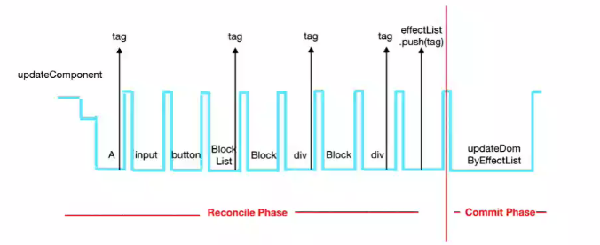

# React setState 运行机制
> - setState是同步操作，采用批处理机制
> - react采用了事务transaction设计思想
> - vue采用的浏览器的event-loop机制: 主队列，异步队列(微队列、宏队列)，因此说vue是依赖了JS语言的特性，而不像大厂出品的react

## 先看一段代码，并判断输出值
```
class App extends Component {
  constructor(props){
    super(props);
    this.state = {
      count: 0
    };
  }
  componentDidMount(){
    let me = this;
    me.setState({
      count: me.state.count + 1
    });
    console.log('第1次:', me.state.count);
    me.setState({
      count: me.state.count + 1
    });//1
    console.log('第2次:', me.state.count);
    setTimeout(function(){
      me.setState({
        count: me.state.count + 1
      });
      console.log('第3次:', me.state.count);
    }, 0);
    setTimeout(function(){
      me.setState({
        count: me.state.count + 1
      });
      console.log('第4次:', me.state.count);
    }, 0);
  }
  render() {
    return (
      <div className="App">
        <p>{this.state.count}</p>
      </div>
    );
  }
}
export default App;
//页面显示 3，输出结果如下:
第1次:0
第2次:0
第3次:2
第4次:3
```
> - 为什么不是 1 2 3 4呢?
> react采用批处理，因此react只会执行最后一个setState，前面的setState被react忽略掉；由于react无法将setTimeout加入到批处理当中，因此后面两个setTimeout里面setState单独执行，进而批处理剩下第二个setState，故而第1次:0
> - 为什么不是 0 1 2 3呢？
> react采用事务的机制来处理setState，要先收集setState要做的事情，然后再之后的某一个时间点进行统一处理，**注意:setState是同步的操作，是在主线程运行的，但它被抽出来了，执行事务的机制，先收集，然后往下走，相对来说，给我们的感觉像是异步的**，因此第2次:0
> - 接下来就是 第3次:2  第4次:3，setState不参与批处理和事务机制，因此就直出了

## V15 版本的问题
> 由于react事务统一处理机制(统一收集，主线程统一执行)，如果setState的内容过大时，render时会造成页面的卡死，这一点在16版本进行了优化
> - vue是异步线程的操作，因此不会卡死

## V16 版本的优化
> 为了解决15版本卡死的问题，V16提出了Fiber，已经更新的react-dom
> **React Fiber**
> - Reconciler即Virtul DOM, 用于计算新老View的差异(dom-diff)
> - React 16之前的 Reconciler 叫 **Stack Reconciler**
> - Fiber是React新的Reconciler，Fiber是一次重量级的核心架构的更换

> Reconciler和render两个概念引出了phase概念
> - phase指的是React组件渲染时的阶段
> - - Reconciler阶段: 依序遍历组件，通过diff算法，判断组件是否需要更新，给需要更新的组件加上tag，遍历在完成后，将所有带有tag的组件加到一个数组中，这个阶段的任务可以被打断，先执行新的重要任务，待执行完毕后，再回来继续Reconciler
> - - Commit阶段: 根据在Reconciler阶段生成的数组，遍历更新DOM，这个阶段要一次性执行完


## Filber Reconciler VS Stack Reconciler 
> - Stack: 以前react渲染相关的事务是连续的，一旦开始，就会run to completion.
> - Fiber: 现在react事务是由一系列Fiber的更新组成，因此可以在多个帧中断断续续的更细Fiber，最后commit变化(将原来的整个Virtul DOM的更新任务拆分成一个个的小任务，每次做完一个小任务后，放弃一下自己的执行将主线程空闲出来，看看有没有其他任务，如果有，就暂停本次任务，执行其他任务，如果没有，就继续下一个任务)
> - **总结: V16把以前的一个大事务改为拆分成一个个小事务，标记为tag，优先级高的就打断事务的执行，释放主线程**
